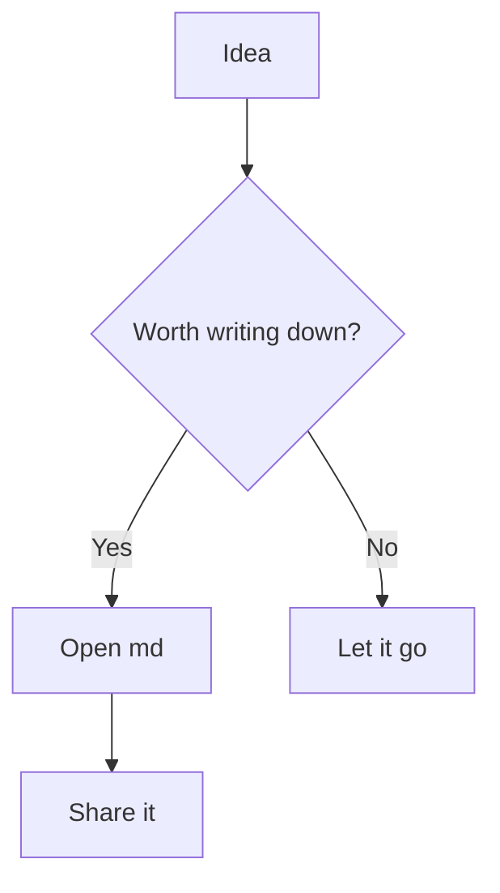
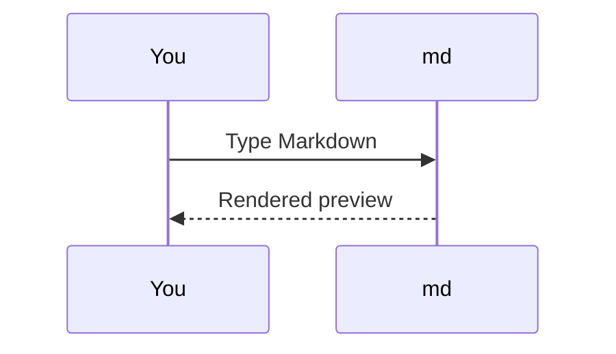
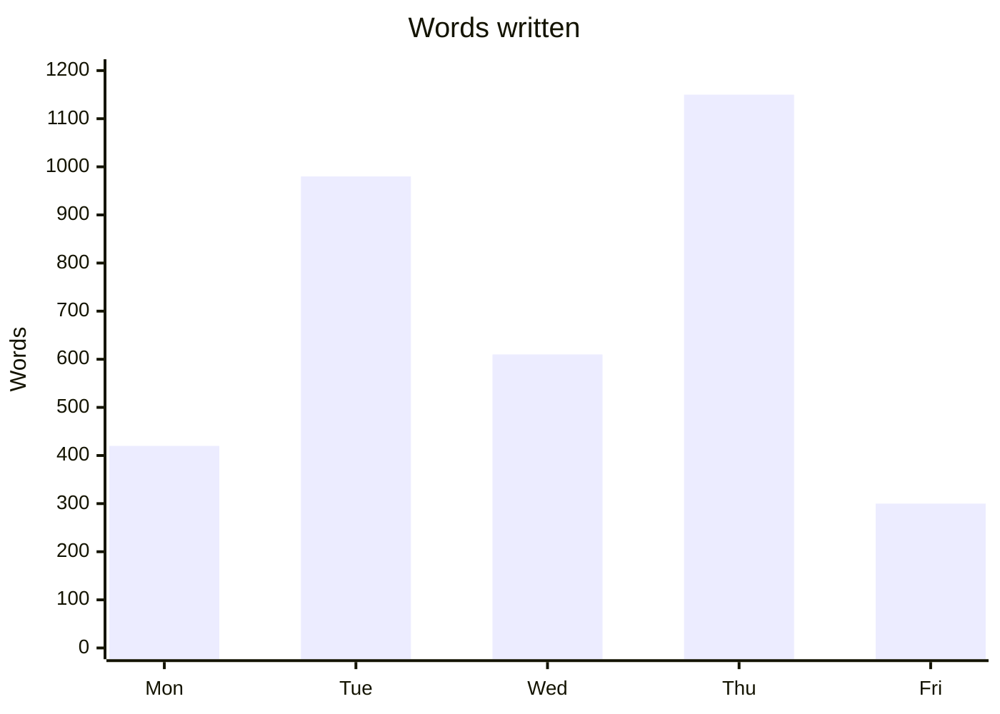
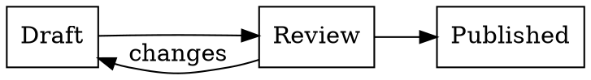
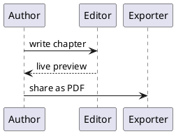
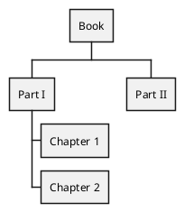

# Diagrams

Describe a diagram in text and md draws it. Three engines — Mermaid,
Graphviz and PlantUML — are bundled with the app and run entirely
offline: nothing is uploaded, and everything you see here renders the
same way in the preview, in print, and in an exported PDF.

## Mermaid

A fenced block tagged `mermaid` becomes a diagram. A flowchart:



A sequence diagram:



Mermaid is not only boxes and arrows — it draws charts too:



The full set available here: `flowchart`, `sequenceDiagram`,
`classDiagram`, `stateDiagram-v2`, `erDiagram`, `journey`, `gantt`,
`pie`, `quadrantChart`, `requirementDiagram`, `gitGraph`, `C4Context`,
`mindmap`, `timeline`, `kanban`, `sankey-beta`, `xychart-beta`,
`block-beta`, `packet-beta`, `architecture-beta`, `radar-beta` and
`treemap-beta`.

## Graphviz

A block tagged `dot` (or `graphviz`, or `gv`) is laid out by Graphviz —
the classic tool for graphs that are described, not drawn:



Graphviz has several layout programs, and each one can be named as the
language of the block — `dot` (the default, for hierarchies), `neato`,
`fdp`, `sfdp` (spring models), `circo` (circular), `twopi` (radial),
`osage` and `patchwork`. The same graph, laid out by `circo`:

```circo
digraph { a -> b -> c -> d -> a; a -> c }
```

Clusters, record shapes and HTML-style labels all work as they do in
Graphviz itself.

## PlantUML

A block tagged `plantuml` (or `puml`) is rendered by PlantUML — wrap the
source in `@startuml` … `@enduml`:



PlantUML is far more than UML. Each of these has its own `@start…`
opener, and any of them can go in a `plantuml` block: `@startmindmap`
and `@startwbs` (mind maps and work breakdowns), `@startgantt`
(schedules), `@startsalt` (interface wireframes), `@startjson` and
`@startyaml` (data structures), `@startebnf` (grammars), `@startregex`
(regular expressions as railroad diagrams), `@startnwdiag` (networks),
`@startchen` (entity–relationship), `@startditaa` (ASCII art turned into
a drawing), and `@startlatex` / `@startmath` (formulas). A work
breakdown, for instance:



## Diagram files

A diagram does not have to live inside a Markdown document. Open a
`.puml` file and md renders it as a diagram while you edit the source —
and a `.gv` file of Graphviz DOT does the same.

Because diagrams are plain text, they copy, edit, and version like prose.
